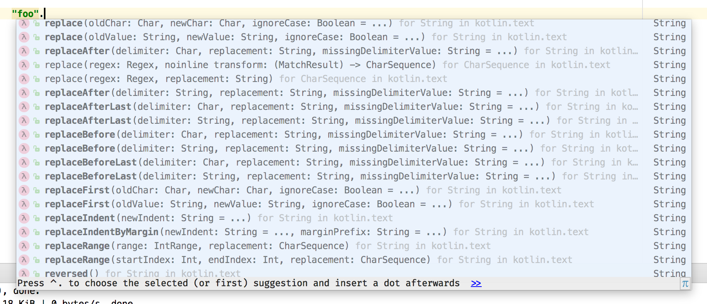

## Intro to Kotlin


A overview of Kotlin language and features.

---

## What is it?

- "Statically typed programming language for the JVM, Android and the browser"
- 100% interoperable with Java™     <!-- .element: class="fragment" -->
- developed by JetBrains            <!-- .element: class="fragment" -->
- concise                           <!-- .element: class="fragment" -->
- safe                              <!-- .element: class="fragment" -->

---

## Where can I use it?

- jvm                   <!-- .element: class="fragment" -->
- android               <!-- .element: class="fragment" -->
- javascript            <!-- .element: class="fragment" -->
- native targets        <!-- .element: class="fragment" -->

---

## Enough chit-chat, let's get into the details

---

#### val/var

```kotlin
// val == 'final'
val aString = "really, a string" // <- semicolons unnecessary

// var == 'not final'
var anotherString = aString
```

---

#### type inference

```kotlin
val anInt: Int = 42
val aCompileError: String = 98L
```

---

#### function structure

```kotlin
fun add(left: Int, right: Int): Int {
    return left + right
}
```

---

#### named & default args

```kotlin
// note optional return type
fun sayHi(greeting: String = "Howdy",
          name: String = "Honored Guest") {
    println("$greeting, $name!")
}

fun main(args: Array<String>) {
    sayHi()
    sayHi(name = "Shane")
    // order doesn't matter with named args
    sayHi(name = "Dave",
            greeting = "Welcome to the conference room")
}
```

- fun sayBye(name = "Builder Pattern")      <!-- .element: class="fragment" -->

---

## expression returns

```kotlin
fun getServiceResult(condition: Boolean): String {
    val result = if (condition) {
        "Service OK"
    } else {
        "Service Failure"
    }
    return result
}
```

+++

## expression returns

```kotlin
// or even better:
fun getServiceResult(condition: Boolean): String {
    return if (condition) {
        "Service OK"
    } else {
        "Service Failure"
    }
}
```

+++

## expression returns

```kotlin
// whaaat
fun getServiceResult(condition: Boolean) = if (condition) {
    "Service OK"
} else {
    "Service Failure"
}
```
---

## classes

```kotlin
class RateLimiter(val maxPermits: Int,
                  val refillRate: Double) {

    var availablePermits = maxPermits

    fun getPermits(requested: Int): Boolean {
        return if (this.availablePermits >= requested) {
            this.availablePermits-=requested
            true
        } else {
            false
        }
    }
}
```

+++

## classes

```kotlin
val limiter = RateLimiter(50, 2)
```

+++

## data classes

```kotlin
data class Person(val name: Name,
                  val age: Int,
                  val gender: Gender)

data class Name(val first: String,
                val last: String,
                val middle: String? = null)

enum class Gender {
    MALE,FEMALE,NA
}
```

+++

## data classes

- automatic:
  - .equals()               <!-- .element: class="fragment" -->
  - .hashCode()             <!-- .element: class="fragment" -->
  - .toString()             <!-- .element: class="fragment" -->
  - person.copy(age = 25)   <!-- .element: class="fragment" -->
  
---


## .equals() == `==`

```kotlin
fun equals() {

    val p1 = Name(first = "joe", last = "schmoe")
    val p2 = Name(first = "joe", last = "schmoe")
    
    p1 == p2 // true: structural equals
    p1 === p2 // false: identity equals
}
```
---

## null safety

```kotlin
val name: Name = Name(first = "Cliff", last="Martinez")

val maybeName: Name? = null
```

+++

## null safety

 

+++

## null-safe operations


+++

## elvis :?

```kotlin
val maybeNullMiddle: String? = name?.middle
val middleWithDefault: String = name?.middle ?: "n/a"
val middleOrError: String = name?.middle ?:
        throw RuntimeException("noooo")
```

---

## casting - unchecked

```kotlin
interface Job
class FBJob: Job
class TWJob: Job

fun castingExample(job: Job) {
    val fbJob = job as FBJob
}
```

+++

## casting - checked + smart

```kotlin
fun smartCastExample(job: Job) {
    when(job) {
        is FBJob -> handleFbJob(job)
        is TWJob -> handleTWJob(job)
        else -> println("unknown job $job")
    }
}
fun handleTWJob(job: TWJob) { /* todo */ }
fun handleFbJob(job: FBJob) { /* todo */ }
```

---

## when

```kotlin
fun demoWhen(x : Int) {
    when (x) {
        1 -> print("x is 1")
        2, 6 -> print("x is 2 or 6")
        3, 4 -> print("x is 3 or 4")
        5, in 7..10 -> print("x is 5, 7, 8, 9, or 10")
        else -> print("x is out of range")
    }
}
```
---
## string fun

```kotlin
fun stringFun(a: String, b: String) {
    println("a = $a, b length = ${b.length}")
}
```
+++
## more string fun
```kotlin
val aBigLongString = """
    select say, goodbye
    FROM arduous_ml_strings
    WHERE language = 'kotlin';
"""
```

---
## deconstruction

```kotlin
// with data classes
fun fablesOfTheDeconstruction() {
    val (name, age, gender) = person
    
    // or tuple classes
    val pair = Pair("left", 2)
    val (first, second) = pair
}
```

---

## extension functions

```kotlin
fun String?.isValidId(): Boolean {
    return if (this == null) {
        false
    } else {
        this.length in 4..8
    }
}
```

+++

## extension functions

```kotlin
fun extExample(idString: String?) {
    if (!idString.isValidId()) {
        throw RuntimeException("invalid")
    }
}
```


---

## sealed classes

```kotlin
sealed class ServiceResult<T>
data class Success<T>(val result: T) : ServiceResult<T>()

sealed class Failure : ServiceResult<Nothing>() {
    data class Permanent(val message: String): Failure()
    data class Retriable(val message: String, val retriesRemaining: Int): Failure()
    data class Unknown(val  message: String): Failure()
}
```

+++

## sealed classes

```kotlin
fun <T> handleResult(res: ServiceResult<T>) {
    return when (res) {
        is Success -> handleSuccess(res.result)
        is Failure -> {
            when (res) {
                is Failure.Permanent -> TODO()
                is Failure.Retriable -> TODO()
                is Failure.Unknown -> TODO()
            }
        }
    }
}
fun <T> handleSuccess(successPerson: T) {
  TODO()
}
```

+++

## sealed classes


---

## objects

```kotlin
// singleton object
object SingletonWhatever {
    fun getWhat() = "What"
    fun getEver() = "eveeerrr"
}
```

+++

## objects

```kotlin
// anonymous objects
fun attachListener() {
    window.addMouseListener(object : MouseAdapter() {
        override fun mouseClicked(e: MouseEvent) {}
        override fun mouseEntered(e: MouseEvent) {}
    })
}
```

+++
## objects

```kotlin
// temporary object
fun anytimeObject() {
    val point = object {
        val x = 22.2
        val y = 44.2
    }
    print(point.x)
}
```
---

## delegation

  - 2 types of delegation
  - class delegation
  - property delegation

+++

## class delegation

```kotlin
// class delegation - awesome
interface Answer {
    fun getAnswer(): Double
}
class AnswerImpl: Answer {
    override fun getAnswer() = 42.2
}
class AnswerPlus(answer: Answer) : Answer by answer {
    // can do other stuff here
}
fun act() {
    val aPlus = AnswerPlus(AnswerImpl())
    println(aPlus.getAnswer())
}
```

+++

## property delegation

```kotlin
class Example{
    var valByExampleDelegate by ExDelegate()
}

class ExDelegate {
    operator fun  getValue(ref: Example, property: KProperty<*>): Any {
        return "$ref, delegated '${property.name}' to me!"
    }

    operator fun setValue(ref: Example, property: KProperty<*>, value: Any) {
        println("$value has been assigned to '${property.name} in $ref.'")
    }
}
```

+++

## property delegation

```kotlin
class Example{
    val lazyVal by lazy {
        println("lazy was called")
        "lazy-return-val"
    }

    var watched by Delegates.observable("<unset>", {
        p, old, new -> println("$old becomes $new")
    })
}
```
---

## lambdas

```kotlin
fun lambda() {
    val sum = { a: Int, b: Int -> a + b }
    sum(1, 2) // 3
}
```

+++

## lambas

```kotlin
fun lambda2() {
    fun doSomething(a: Int, something: (Int) -> Int): Int {
        return something(a)
    }

    val res = doSomething(4, { input -> input / 2 })
    
    val res2 = doSomething(2) {
        it * 2
    }
}
```

+++

```kotlin
fun lambda3() {
    listOf(Name("joe", "schmoe"))
            .map { Name::last }
    
    val fName = Name::first
}
```
---

## receiver functions

```kotlin
             // `build` can be thought of as a local extension function 
             // on HashMap
fun buildMap(build: HashMap<Any,Any>.() -> Unit): Map<Any,Any> {
    val map: HashMap<Any,Any> = HashMap()
    map.build()
    return map;
}
```

+++
## receiver functions

```kotlin
fun buildMap(build: HashMap<Any,Any>.() -> Unit): Map<Any,Any> {
    val map: HashMap<Any,Any> = HashMap()
    map.build()
    return map;
}

fun example() {
    val map = buildMap {
        this.put("k","v")
        (1..10).forEach { put("k" + it, "it's $it") }
    }
}
```

---

## stdlib - apply
```kotlin
public inline fun <T> T.apply(block: T.() -> Unit): T { 
    block(); 
    return this 
}

```

+++
## stdlib - apply
```kotlin
fun stdLibReceivers() {
    val p = Properties().apply {
        this.put("p1", 22)
        this.put("p2", 42)
    }
}
```

## stdlib - let
```kotlin
public inline fun <T, R> T.let(block: (T) -> R): R = block(this)
```

+++
## stdlib - let
```kotlin
fun stdLibReceivers() {
    val last = Name("joe", "schmoe").let {
        this.last
    }
}
```

+++
## stdlib - strings

 

---

## collection goodies

```kotlin
fun collectionGoodies() {
    val list:List<Iterable<Int>> = listOf(
            listOf(1,2,3,4,5,6,7,8,9,10),
            4..55
    )

    val groupedFlattenedFiltered : Map<Int, List<Int>> = list
            .flatten()
            .filter { it % 2 == 0 }
            .map{ it - 1 }
            .filter {
                it > 4
            }
            .groupBy { it % 4 }
}
```
---

## conclusion

  * easy to get started <!-- .element: class="fragment" -->
  * it's a lot of little things <!-- .element: class="fragment" -->
  * explicit nulls are yuuuge <!-- .element: class="fragment" -->
  * minimizing verbosity == maximizing readability <!-- .element: class="fragment" -->
  * easier read == easier to review == fewer bugs <!-- .element: class="fragment" -->

---

## resources

  * https://kotlinlang.org/community/
  * https://github.com/Kotlin/kotlin-koans
  
