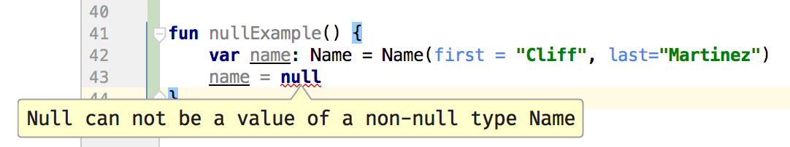
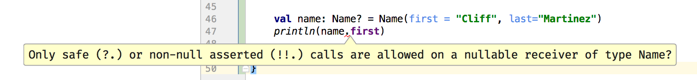
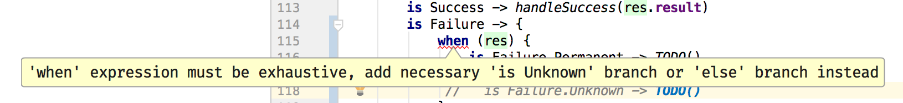

## Intro to Kotlin


A overview of kotlin language features.

---

## What is it?

- developed by jetbrains
- more consice than java
- interoperable
- pragmatic
- safe

---

## Where can I use it?

- jvm
- android
- javascript
- native targets

---

## Enough chit-chat, let's get into the details

---

#### val/var

```kotlin
// val == 'final'
val aString = "really, a string" // <- semicolons unnecessary

// var == 'not final'
var anotherString = aString
```

---

#### type inference

```kotlin
val anInt: Int = 42
val aCompileError: String = 98L
```

---

#### function structure

```kotlin
fun add(left: Int, right: Int): Int {
    return left + right
}
```

---

#### named & default args

```kotlin
// note optional return type
fun sayHi(greeting: String = "Howdy",
          name: String = "Honored Guest") {
    println("$greeting, $name!")
}

fun main(args: Array<String>) {
    sayHi()
    sayHi(name = "Shane")
    // order doesn't matter with named args
    sayHi(name = "Dave",
            greeting = "Welcome to the conference room")
}
```

- fun sayBye(name = "Builder Pattern")      <!-- .element: class="fragment" -->

---

## expression returns

```kotlin
fun getServiceResult(condition: Boolean): String {
    val result = if (condition) {
        "Service OK"
    } else {
        "Service Failure"
    }
    return result
}
```

+++

## expression returns

```kotlin
// or even better:
fun getServiceResult(condition: Boolean): String {
    return if (condition) {
        "Service OK"
    } else {
        "Service Failure"
    }
}
```

+++

## expression returns

```kotlin
// whaaat
fun getServiceResult(condition: Boolean) = if (condition) {
    "Service OK"
} else {
    "Service Failure"
}
```
---

## classes

```kotlin
class RateLimiter(val maxPermits: Int,
                  val refillRate: Double) {

    var availablePermits = maxPermits

    fun getPermits(requested: Int): Boolean {
        return if (this.availablePermits >= requested) {
            this.availablePermits-=requested
            true
        } else {
            false
        }
    }
}
```

+++

## classes

```kotlin
val limiter = RateLimiter(50, 2)
```

+++

## data classes

```kotlin
data class Person(val name: Name,
                  val age: Int,
                  val gender: Gender)

data class Name(val first: String,
                val last: String,
                val middle: String? = null)

enum class Gender {
    MALE,FEMALE,NA
}
```

+++

## data classes

- automatic:
  - .equals()               <!-- .element: class="fragment" -->
  - .hashCode()             <!-- .element: class="fragment" -->
  - .toString()             <!-- .element: class="fragment" -->
  - person.copy(age = 25)   <!-- .element: class="fragment" -->
  
---

## null safety

```kotlin
val name: Name = Name(first = "Cliff", last="Martinez")

val maybeName: Name? = null
```

+++

## null safety

 

+++

## null-safe operations



+++

## elvis :?

```kotlin
val maybeNullMiddle: String? = name?.middle
val middleWithDefault: String = name?.middle ?: "n/a"
val middleOrError: String = name?.middle ?:
        throw RuntimeException("noooo")
```

---

## casting - unchecked

```kotlin
interface Job
class FBJob: Job
class TWJob: Job

fun castingExample(job: Job) {
    val fbJob = job as FBJob
}
```

+++

## casting - checked + smart

```kotlin
fun smartCastExample(job: Job) {
    when(job) {
        is FBJob -> handleFbJob(job)
        is TWJob -> handleTWJob(job)
        else -> println("unknown job $job")
    }
}
fun handleTWJob(job: TWJob) { /* todo */ }
fun handleFbJob(job: FBJob) { /* todo */ }
```

---

## deconstruction

```kotlin
// with data classes
val (name, age, gender) = person

// or tuple classes
val pair = Pair("left", 2)
val (first, second) = pair

```

---

## extension functions

```kotlin

fun String?.isValidId(): Boolean {
    return if (this == null) {
        false
    } else {
        this.length in 4..8
    }
}
```

+++

## extension functions

```kotlin
fun extExample(idString: String?) {
    if (!idString.isValidId()) {
        throw RuntimeException("invalid")
    }
}
```


---

## sealed classes

```kotlin
sealed class ServiceResult<T>
data class Success<T>(val result: T) : ServiceResult<T>()

sealed class Failure : ServiceResult<Nothing>() {
    data class Permanent(val message: String): Failure()
    data class Retriable(val message: String, val retriesRemaining: Int): Failure()
    data class Unknown(val  message: String): Failure()
}
```

+++

## sealed classes

```kotlin
fun <T> handleResult(res: ServiceResult<T>) {
    return when (res) {
        is Success -> handleSuccess(res.result)
        is Failure -> {
            when (res) {
                is Failure.Permanent -> TODO()
                is Failure.Retriable -> TODO()
                is Failure.Unknown -> TODO()
            }
        }
    }
}
fun <T> handleSuccess(successPerson: T) {
  TODO()
}
```

+++

## sealed classes



---

## objects

```kotlin
// singleton object
object SingletonWhatever {
    fun getWhat() = "What"
    fun getEver() = "eveeerrr"
}
```

+++

## objects

```kotlin
// anonymous objects
fun attachListener() {
    window.addMouseListener(object : MouseAdapter() {
        override fun mouseClicked(e: MouseEvent) {}
        override fun mouseEntered(e: MouseEvent) {}
    })
}
```

+++
## objects

```kotlin
// temporary object
fun anytimeObject() {
    val point = object {
        val x = 22.2
        val y = 44.2
    }
    print(point.x)
}
```
---

## delegation

  - 2 types of delegation
  - class delegation
  - property delegation

+++

## delegation

```kotlin
// class delegation - awesome
interface Answer {
    fun getAnswer(): Double
}

class AnswerImpl: Answer {
    override fun getAnswer() = 42.2
}

class AnswerPlus(val answer: Answer) : Answer by answer {
    // can do other stuff here
}
```

- TODO:
  - delegation
  - lambdas
    - method ref
  - receivers
  - stdlib
  - sequences
  - coroutines
  - Type aliases